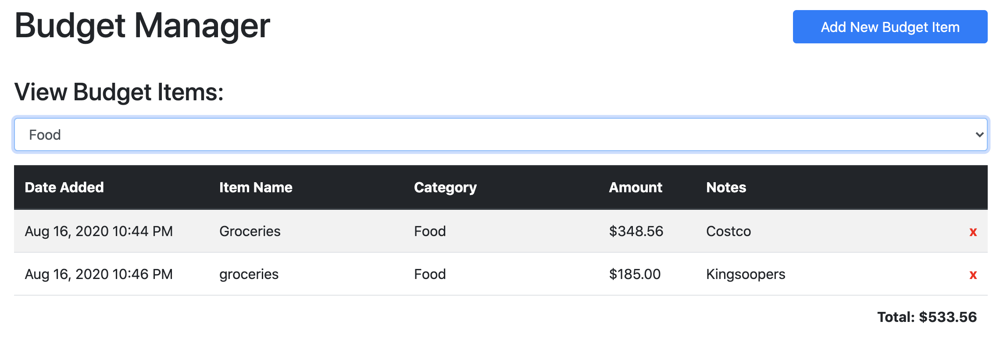
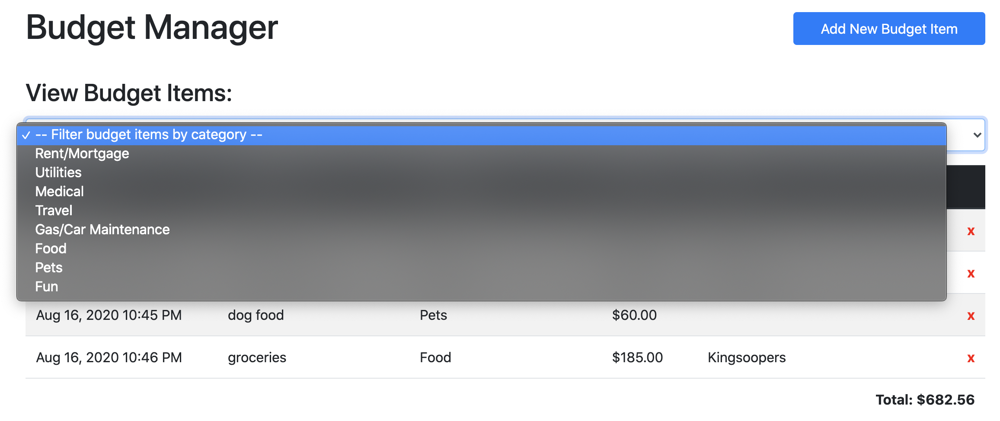

# Budget Manager

## Tech Used
* JavaScript
* jQuery 

## Functionality
* User can create new budget items
* Sort by category
* Shows total amount spent per sort or all together
* Delete budget items
* Uses localStorage for data persistence

Click on Add New Budget Item button to add an item

Add budget item by clicking the button

Filter the budget list

Unfilter the budget list

Click on X to delete the dog food item from the budget

## Authors

* **Sarah Cullen** - *Initial HTML/CSS*
* **Jason Tilley** - *java script*

## License
*MIT* © 2020 Sarah Cullen, Jason Tilley
